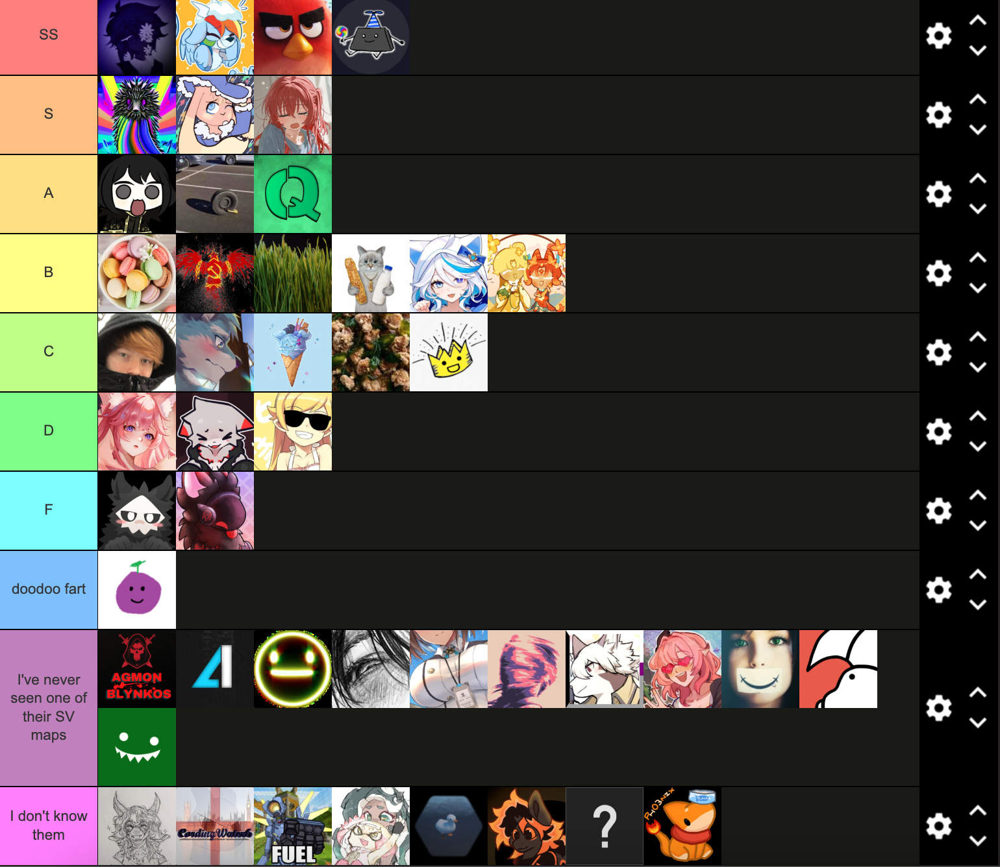

# SS Tier
**aster** - Aster is for me is the current crème de la crème of SV mappers. They have shown that they are capable of making many types of maps, with a blend of innovation and personality to them. I personally respect multidimensional mappers a lot, and that's why they will go at the top. Good but not over the top usage of vibrato, solid AFFINE understanding, and extremely smooth base SV layering come together to make some of the best maps this game has seen.
**riley** - Probably by far my favorite gay SV mapper. I think it's a weird conundrum here, where the maps riley has ranked are (IMO) not very significant to things that are laying in the unranked section, like lightspeed. However, the flagship maps that Riley has really shine out compared to the rest of the sv map pool. I think what makes riley special is the fact that they can innovate so much while rarely even using one of the tools given (vibrato). I sort of think of it like fried rice, there are so few ingredients that go into it that if one is bad, it will screw up the whole dish. Riley's maps preserve this delicate balance quite well, so he will go in SS tier for me.
**entauri** - While entauri doesn't map quite as much anymore, the maps he pumped out in his prime were nothing short of beautiful. I don't really see him for a sense of innovation; instead, I see him as someone who has practically mastered expressiveness through maps like nightmare and what the devils. I actually took a lot of inspiration on how I wanted my maps to look from his usage of auto exponentials and vibrato.
**emik** - Honestly speaking, I was debating whether to put him at S or SS, but I decided on SS because of the replayability factor. Quite a few Emik maps I play have a sort of strange vibe to them when I first played them, but so many maps I grew to love more and more each time I played them (such as MultiVerse or Dream Odyssey). Similar to riley (but a little more extreme), Emik's lack of vibrato allows the base SV layer to truly shine, and when he does need to express the "grunginess" of a song, the rapid-period sinusoidal works extremely well.

### Overall, each SS level mapper has a level of individuality and something they specialize in enough to warrant them being in the highest tier there is to offer.

# S Tier
**amogu aka kloi34 aka mental 727 aka like 10 other things** - The grandfather of current SV. My ranking is probably a little biased because he is the one who made the best plugin to touch the game, but his maps are still quite excellent. They fall into a similar category to Emik, with little vibrato and a sort of charm that you can only pick up after a few replays. However, I don't think they have the same capabilities as Emik, and a select few of their maps are misses for me, putting them in S tier.
**Spartan** - Spartan has actually mapped very little, but from what I've seen, there is a massive amount of potential. While stop-motion lacks the nuance that brings an SV map to the next level, the ideas and execution present are that of someone with much more experience than Spartan actually has. We have seen him yet to fully prove himself, so I will put him in S tier.
**txbi** - If you asked me before ESVT, I'd probably put txbi at B, but their improvement during ESVT has been astronomical. Some of my favorite charts are made from him, and I think it's because being both a music producer and a SV-er allows him to really think about each individual motion that goes on throughout a chart. What makes txbi stand out is that he uses AFFINE better than almost anyone else, and maps made within his comfort zone (QSVDS 20-35) shine out a lot.

### Each S-tier mapper produces flagship maps which have a lot of charm to them, but they aren't yet as versatile or as innovative as I'd like for me to put them in SS tier.

# A tier 
**avery** - avery's maps have always been really... alive, for lack of a better word. As the "vibrato main", my inside joke is that they can make any effect with flicker and vibrato, and I would dare say they know how to use vibrato better than anyone else. However, their maps tend to feel a little similar to themselves due to this liberal usage of the plugin, so I will put them in A tier. 
**Awii** - I honestly can't put a reason on why I like some of their maps so much, but they have this uniqueness to them that I've never seen anywhere else. Probably the best example of this is HELLO!?!?, which is such a unique map that that alone brings them up to this tier. I don't really see much else going for them though, which limits them from going further.
**Qweet25** - Qweet has a metric boat load of mapping experience which you can really tell throughout his flagship maps. While his maps are simple on paper, the execution of them works really well. Again, the maps from him that stand out the most are unranked (such as pump), and the mixture of tech/flam gameplay and SV is done perfectly, although the simplicity of his maps limits him in his creativity.

### Each mapper here has one type of SV map they really excel in, but they fall short in variety.

# B tier
**MACarono** - If we ignore arrogation, MACarono has a lot of potential. Their newest map 996 is fantastic, although it suffers a bit in playability because I don't think he himself can play the maps. This issue will be a common theme throughout the rest of the tier list, though I believe with more experience MACarono can make it to A or even S tier.
**KGB Official** - Similar to Qweet, but even more one-dimensional. I feel like I've only seen him make one type of map (dariacore + vibrato + linear jump + expo), and even though he does it quite well, the lack of variety really holds him back.
**kusa** - An oldie but a goodie, their maps carry a similar charm to Emik's, with a lot more vibrato involved (maybe because of the songs he's actually charting). With kusa, simplicity is key, but in the modern age this also limits him from going higher up in the rankings.
**sums** - sums is an interesting case because his map quality is quite good beyond a few small mistakes, but I've only ever seen him make an excellent map twice - get a clu and been a minute. His other maps are okay, but pale in comparison to those two in my opinion. As such, balancing them out yields B tier.
**kona** - Kona has some fun maps, but overall I think she struggles with playability for the exact opposite reason that MACarono does - she's so good that her mapper bias blinds her from the true difficulty or frustration of some maps (such as Elevator). When the maps are playable though, they are quite fun (like Time Traveler).
**SyncDeathWyvern** - Wyvern has made some really nice simple maps like Northwind and Cradles, but I have yet to see them outside that. If they explore more high QR sv and do it well, I will bump them up.

### B tier is varying between above-average mappers and mappers who struggle to find success outside a few select maps. I can kinda relate-

# C tier
**CommandoBlack** - I have only ever seen this man make one map, and it's fine... I guess? The map itself is fun to play but on paper has a lot of issues. Then again, it is old, so maybe my ranking will change when I see more of his maps.
**Drater** - Drater's effects are good, but he reuses them so much that I think he has to work at a recycling plant or something as his full time job. The best examples for this are vitality and lagtrain.
**IceDynamix** - I've never really seen them make a full-on effect map, only supplemental SV to some pretty good gameplay, so they'll stay here for now until further notice.
**Jindax** - They've really improved over the course of the last iteration of ESVT. While they still need to work out some minor flaws in their charting philosophy, they have a decent amount of potential.
**KingScrub** - I feel like scrub could definitely be B tier if he didn't constantly fall into the basic splitscroll pitfall. Also he needs to playtest his own maps, but the effect potential is there.

## Average gamers or slightly above average. Nothing more to say.

# D tier (imma yap)
**akiri** - Oh boy. I really didn't think akiri was bad at all when I first played their maps, and to be honest they still aren't; e.g. Horizon Blue is an awesome reading map. However, their high QR + SV style is just... not it. I feel like akiri maps fall into two categories - expressive but extremely hard to play, or boring and easy to play. I don't even think it's a matter of talent - akiri just doesn't put in the effort into SV maps that make them good (case in point, who do you love - has like a 25-second section of just teleport stutter 50% 0.5x speed, and the entire map feels like they took entauri's diff and made all the svs positive). This is not meant to be hate, but more rather frustration, because they definitely can make good maps - I just don't think they put in the time to.
**Jack932** - Probably the only map I've seen from him is HITO mania (although if his newer maps are better than I'll change this). HITO mania struggles from a lot of issues, primarily displacement, and some base-layer ideas just don't really make sense to me, even after playing them quite a few times. I've seen videos of Ouais Ouais, which does incline me to put him into C-tier, but I haven't actually played it myself and videos are not a good judge of how good an SV map is, as I put a lot of emphasis into playability and not just visualizations. There is some potential, I just haven't seen it.
**PianoLuigi** - Not gonna lie it's literally just because their maps are hella old, and he probably didn't have access to the same tools we have today, but the maps that he made are kinda just... there. I don't really feel like anything is special about them, and I don't even think the lack of tools is a valid excuse either - MultiVerse was made only a little after PARTY...

### All the reviews speak for themselves. TL;DR - ehhhhh

# F tier

**Hysterical and Max The Proto** - I'm grouping them together because they suffer from the same issue - you can't make good SV if you can't make gameplay. I think they should take some time to chart normal stuff, and the fact that a lot of their maps aren't synced really solidifies this pick for me. Once they take the time to learn how to properly map, I think then they can improve. Hysterical struggles with a similar thing to MACarono, but at a much more fundamental level (view SNUFFY as an example). I've yet to see a max SV chart that is synced.

## See above.

# doodoo fart tier
ESV Sweetplum maps are just horrible, I'm at a 20-30 level in 4 key and the amount of kpop splitscroll SV maps that have 2 receptors is insane. Why are these even allowed to be ranked? The maps are decent once you burn them but by default its just rote memorization and not what I play this game for.

I don't know anyone else so thanks for hearing me yap
